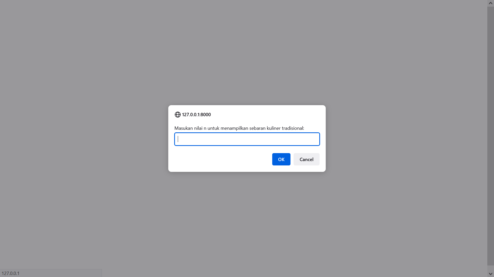
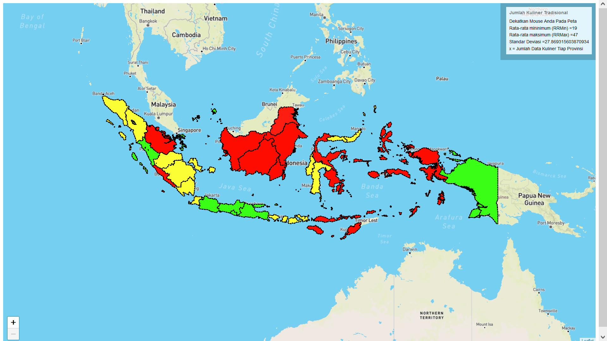

## About Aplikasi

aplikasi dengan data skripsi. Untuk menghitung standar deviasi, rata2 max, rata2 min dan warna yang didapat.

Dapat diakses melalui tautan berikut:
https://kulineran-tradisional.masuk.web.id/

Step 1 Melakukan input nilai acuan

Step 2 Hasil warna yang didapat

